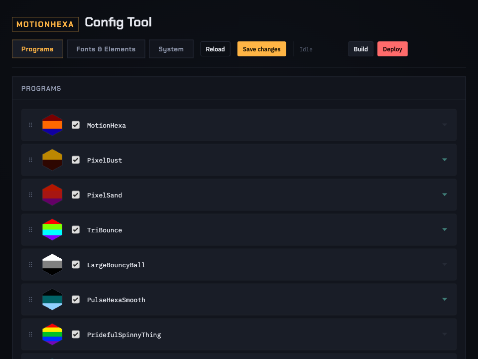
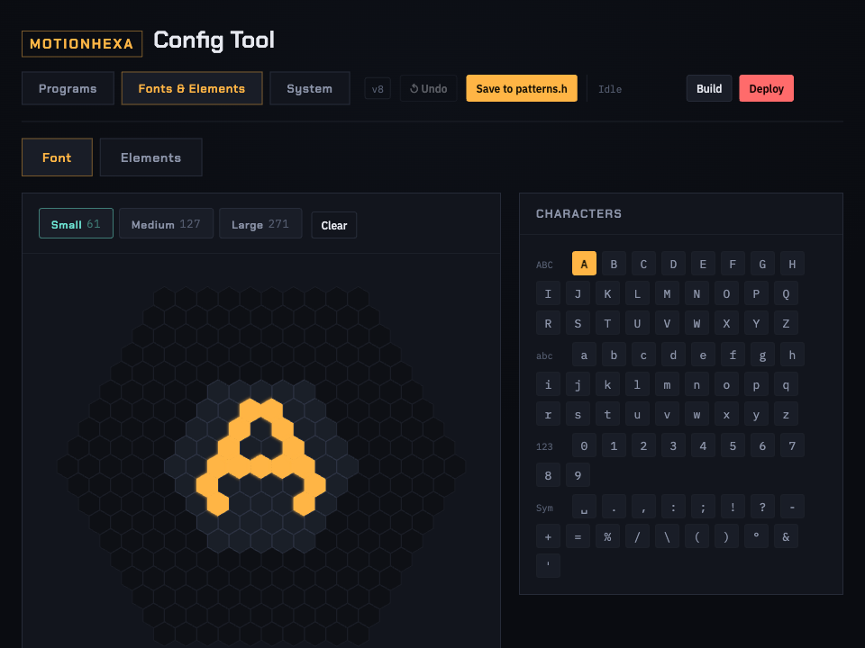
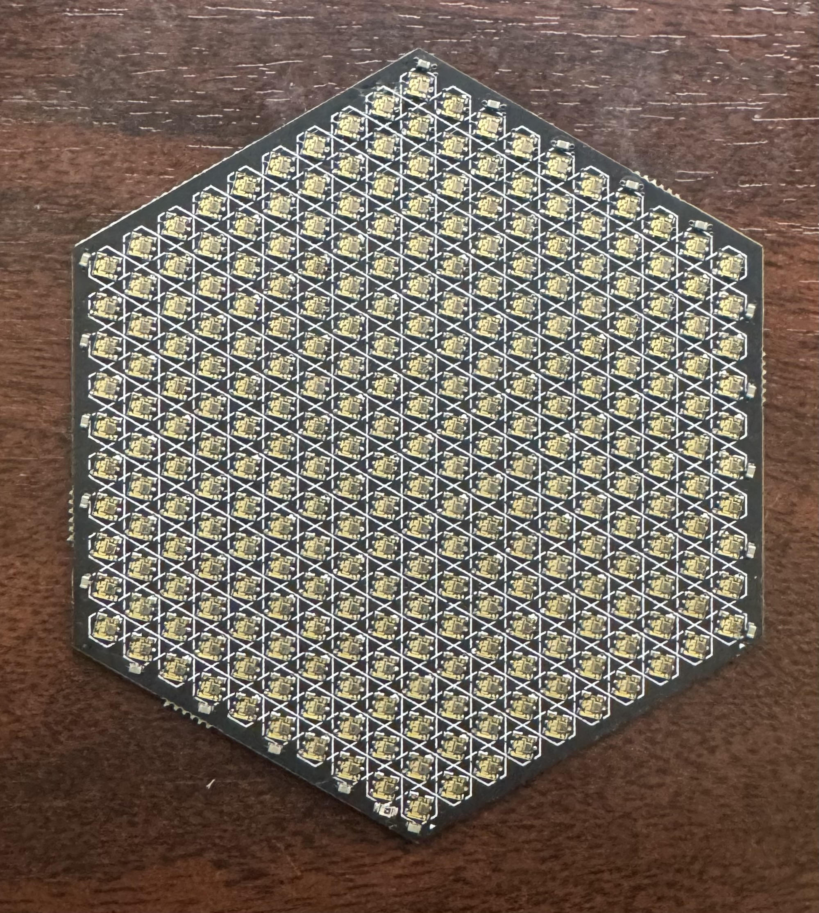

# Motionhexa Config Tool

A local, zero-install browser tool for editing a [motionhexa](https://www.tindie.com/products/starduststorm/the-hexagon/) — a motion-reactive, battery-powered hexagonal LED sculpture — without touching C++. Manage which patterns run, paint custom pixel fonts, tune device settings, and build & flash the firmware, all from one page in your browser.

> This repository's descriptions and day-to-day upkeep are managed collaboratively with [Claude](https://claude.com) (Anthropic).

<br>


## What it does

- **Programs** — enable/disable and drag-to-reorder the pattern rotation, with a live thumbnail per pattern and a settings panel for anything it exposes (speed, particle count, audio sensitivity, etc.)
- **Fonts & Elements** — a full pixel editor for the hex-grid font and icon set used by on-device text, at three sizes (Small/Medium/Large)
- **System** — device name, default brightness, and charge-indicator style
- **Build & Deploy** — compiles with PlatformIO and flashes the connected device, streamed live, from the header of every page

Every edit writes straight to the real source files (`src/main.cpp`, `src/patterns.h`) — no separate config format to keep in sync. This repo bundles the full motionhexa firmware (originally by [starduststorm](https://github.com/starduststorm/motionhexa)) plus a couple dozen new LED patterns, built mostly to give the tool something real to edit and show off.

## Quick start

Requires [Node.js](https://nodejs.org) (no npm install — the server has zero dependencies) and, for Build/Deploy, [PlatformIO](https://platformio.org)'s `pio` CLI.

```
git clone --recurse-submodules https://github.com/freetobelee/motionhexa.git
cd motionhexa
node console/server.js
```

Then open `http://localhost:2710`. On macOS you can also just double-click `console/Start Console.command`.

## Adding a setting

Four tag kinds, all trailing comments on the constant's own line — the scanner is generic, so a new tag of an existing kind needs no server code changes. It currently reads `main.cpp`, `power.h`, and `patterns.h`.

```cpp
// Slider — general Config panel, or a specific program's settings with a 4th arg
const int kTriBounceSpeed = 70; // @tunable("Speed", 10, 200, "TriBounce")

// Text field — System tab only
const char *kDeviceName = "motionhexa"; // @tunable_text("Device Name")

// Labeled choice — an int that's really an index into named options
const int kChargeIndicatorStyle = 0; // @tunable_enum("Charge Indicator", "Gradient Fill", "Percentage", "Pie Fill", "Original")

// Thumbnail — on a pattern's own class line, real colors from its own code
class TriBounce : public BouncyPixels { // @thumbnail("#FF0000", "#80FF00", "#00FFFF", "#8000FF")
```

If the value you want to tag is an inline literal (a constructor argument, say) rather than a named constant, pull it out into one first.

---

## The hardware & original firmware

 

Motionhexa is [starduststorm](https://github.com/starduststorm/motionhexa)'s hexagonal LED sculpture: RP2040, ICM-20948 motion sensor, PDM microphone, USB-C rechargeable battery, 271 SK9822 pixels. A squeeze-through-the-case button controls it directly (click for next pattern, double-click for previous, hold to power on/off or soft-reset). PCB sources are in `hexacontroller/` and `hexa/`; a couple of hardware quirks (a disabled ambient-light sensor, a disabled 5V boost circuit, a v5 charging-ring errata) are noted inline in that source.

**Building:** built with [PlatformIO](https://platformio.org); build the `v5` environment (the MakerFaire2025 hardware revision).
```
git submodule update --init --recursive
pio run -e v5
```
Dependencies ([FastLED], [SparkFun_ICM-20948], [edrean/BQ27427 Battery Fuel Gauge], [dustlib]) fetch automatically on first build.

**Writing a pattern by hand:** subclass `Pattern` in `src/patterns.h` and register it in `src/main.cpp`'s `setup()` with `patternManager.registerPattern<YourPattern>()` — it'll show up in the Config Tool automatically. See any existing pattern in `patterns.h` for the shape.

**If a device won't boot:** hold the USBBOOT button on the hexacontroller board while plugging in USB to force RP2040 mass-storage mode, then re-flash with PlatformIO or drop [the stable release binary](bin/hexa-v5-firmware@ed502d04.uf2) onto the drive that appears.

## Roadmap / project direction

Config Tool:
- Add contextual instructions to the programs that need them (Clock, Solar System)
- Remove the "Saved" indicator text in the Fonts & Elements tool
- Make thumbnails real visual representations of what each program actually looks like, not just a color swatch
- Double-check the audio sensitivity setting actually works on the droplet programs
- Add a way to define which physical face is "the bottom" per program, for the programs that need it (Clock, Solar System, Timer, Glyph Viewer)

Firmware:
- The hex-font glyph library (used by the Fonts & Elements tool and programs like the font test) is still incomplete — a number of characters are still generic auto-generated defaults rather than hand-designed

[FastLED]: https://github.com/FastLED/FastLED
[SparkFun_ICM-20948]: https://github.com/sparkfun/SparkFun_ICM-20948_ArduinoLibrary
[edrean/BQ27427 Battery Fuel Gauge]: https://github.com/edreanernst/BQ27427_Arduino_Library
[dustlib]: https://github.com/starduststorm/dustlib
